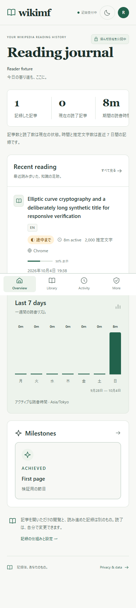
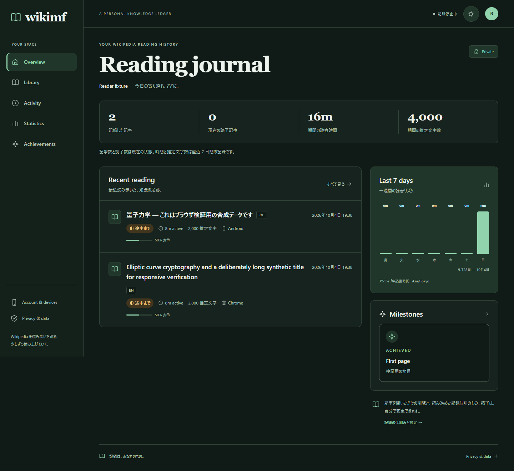

# Issue #14〜#18 とDashboard刷新の検証記録

2026-10-04。M10完了時の記録は [verification.md](verification.md) に保持し、この文書に追加修正の証拠を記録する。実Google/GitHub、HTTPS、署名配布、物理端末の受入は [ST計画](ST-plan.md) と [Issue #13](https://github.com/caprice1026-disc/Wikimf/issues/13) を継続する。

最終実装sourceは `dd575fb3362a43ca00043248bddf9dcca190c385`。mainへの反映を確認し、[CI全4job](https://github.com/caprice1026-disc/Wikimf/actions/runs/37196169054) が成功した。ローカルの `dist/0.1.0-dd575fb3362a/` にdebug APK・Chrome ZIP・Dashboard ZIPを作成し、[manifest](evidence/issues-artifact-manifest.json) にSHA256を固定した。ZIP内の修正ソース、Dashboardの新画面/再認証、Android DEX内のprivacy修正、共通tracker一致を確認し、ブラウザbundleにテストhook/fixtureが含まれないことも検査した。一般公開用の署名・HTTPS設定・実OAuthは含まない。

## 確認コードと重要操作

Issue #14は修正前にWeb GETから確認コードを取得でき、Issue #18は古いsessionでaccount削除が成功することを再現した。修正後、開始応答だけにraw codeを返し、DBはsalt付きPBKDF2-HMAC-SHA256で保存する。誤codeはattemptへ加算し、5回で失効する。

重要操作は10分以内の認証を要求する。既存providerのsubject、User、開始時のWeb sessionを検証し、別subjectでUserを作成・切替しない。成功時はsessionとCSRFを更新し、追加identityの認証だけでは期限を延長しない。公開停止と収集停止は期限外でも可能である。APIは [契約](../../packages/contracts/api.md) を参照する。

実PostgreSQLで全90件が成功した後、5回失敗と追加identityによる期限維持の2ケースを追加し、security suite17件が成功した。[92629dcのCI](https://github.com/caprice1026-disc/Wikimf/actions/runs/37194908179)では全92件と他の3jobも成功した。これには古いsessionで7種類の操作拒否、同一subject成功、異なるsubject/sessionの拒否、CSRF必須、取消、外部return URL拒否を含む。OAuth adapterは合成であり、実providerの署名検証や画面の成功証拠には数えない。

独立レビューでlogoutとcallbackの競合、およびロック待機中の認証期限切れを追加再現した。旧sessionの消費と新session発行を原子的な処理へ改め、待機後にも期限を確認した。reauth/link中の別HTTP logoutが先に完了した場合にsessionを復活させず、期限切れlinkを拒否して元sessionの消費をrollbackする。追加3ケースを含む [実PG全95件](evidence/issues-backend-postgres.txt) が成功した。

## DB移行と復元

`scripts/verify_recovery.py` は [14項目成功](evidence/issues-14-18-recovery.json)。使い捨てDB内でraw event3件、manual state3件、identity4件を持つ0002から0004へ移行し、履歴を保持した。連携待ちcodeを消去し、既存Web sessionでは読み取りを継続でき、重要操作には再認証が必要なことを確認した。実dump/restore後も記事・全履歴・account削除、identity解除、旧token/sessionが復活しない。

既存ローカルDBとQA DBは個別にbackupした後に0004へ更新した。移行時に連携待ちだった要求は再開始する。連携済みdeviceと読書履歴は保持する。

## 実providerで残る確認

Googleにはaccount selectionとconsent、GitHubにはaccount pickerを要求する。これはproviderアカウントの確認であり、既存provider sessionがある端末でパスワード/MFAの再入力を保証するものではない。実際の画面、拒否/取消、別アカウント選択、放置端末への認証強度をST-02で評価する。[Google OIDC](https://developers.google.com/identity/openid-connect/openid-connect)、[GitHub OAuth](https://docs.github.com/en/apps/oauth-apps/building-oauth-apps/authorizing-oauth-apps)

## Androidの削除と同意

Issue #15/#17を修正し、JVM10件とAPI35実エミュレータ8件が成功した。内訳はPrivacy4、Persistence2、実Reader focus1、Dashboard Intent1。debug/release/test APKがbuildでき、lintはerror0、warning9だった。[詳細結果](../../apps/android/verification/privacy-regressions.json)、[端末ログ](../../apps/android/verification/privacy-final-suite.txt)

SQLite v1のquarantine220件・約11MiBをv2へ移行し、有効queueとlocal historyを保持しながら元payloadを消去した。診断はowner/event_id/code/atだけを最大100件保持する。期限、epoch、記事削除、拒否ACK後もpayloadが残らず、新しいeventを保存できた。

SyncとReaderの両方で、同意OFF/collection OFF中は記事URLとeventの送信を止める。実loopback HTTPでcontrol以外の呼出がないこと、再同意時は保持したqueueを送ること、Readerのcached許可がtrueでも最新controlがfalse/503ならresolveしないことを確認した。実API/PGを使うReaderでは10秒以上のactive時間とACKを確認した。

追加の [Android実pairing確認](../../apps/android/verification/pairing-transport.md) も1件成功した。native start→Web GETでcode非開示→QA Web sessionとCSRFでapprove→native exchange→device tokenで`/me`という順で確認し、新しい検証deviceだけを失効させた。既存連携・履歴は保持した。

## Chromeの記録再開

Issue #16は実Chrome154のdeveloper modeで再現した。186件のqueueで実observationが容量上限になり、popupから破棄後にqueue0でもleaseが復活しなかった。[修正前の証拠](evidence/issues-chrome-queue-before.json)

修正後はdiscard、control cleanup、ACKによる空き容量を再評価し、期限切れがなく最大event1件を追加できる場合だけqueue errorを解除する。失効、owner不一致、schema不一致は成功ACKやoffline処理でも解除しない。popupとworkerは同じ停止条件を使う。

単体12件、[実Chrome復旧12判定](evidence/issues-chrome-queue.json)、[既存Chrome9判定](evidence/issues-chrome-smoke.json)が成功。[実API/PG確認](evidence/issues-chrome-api.json)では新device pairing、明示的な連携によるterminal復旧、ACK2件、active時間10,011ms増、queue0を確認した。identity/metadataは合成であり、DOM計測、worker、Chrome storage、HTTP、PGは実動作である。

## Dashboard

概念図を基に白・セージ・深緑とserif見出し、線アイコンを採用した。読書履歴を中心とする配置、7日チャート、本文表示率、milestone、Library/Activity/Statistics/Account/Privacyを統一した。mobile下部navigation、light/dark、loading、empty、部分エラーとretryを確認した。製品の値は実APIから取得し、未対応のカテゴリ・要約・架空目標を追加していない。

[実Chrome26 workflow](evidence/dashboard-redesign-fixture.json) は、既存操作と再認証403、取消、provider選択・解除後の切替、POST/CSRF、戻った後の自動削除禁止、keyboard focus、reduced motion、各route/loading状態を含む。主要文字色・control色9組の [コントラスト計算](evidence/dashboard-redesign-contrast.json) は4.5以上だった。これを全要素のアクセシビリティ監査完了とは扱わない。

[実API/PGの16項目](evidence/dashboard-redesign-api.json) も成功した。同じownerのAndroid15活動とChrome10活動を実API・画面で照合し、端末連携codeの非開示、承認/交換、検証deviceの解除、失効token拒否、390px幅を確認した。browser error/server errorは0件。provider資格情報を使う実認証はSTへ残す。TS/Vite buildと日付/JST/DST境界のunit検証も成功した。

採用した [概念図](evidence/dashboard-redesign-concept.png) の配色と組版をコードで再現した。以下は合成テストデータを表示した実Chromeの画面である。

