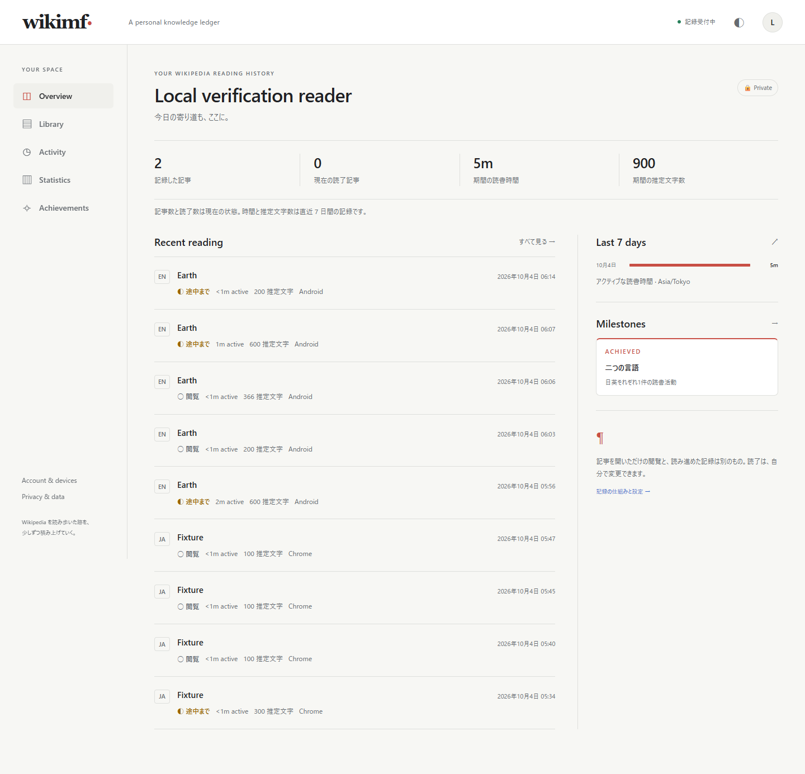

# MVP-A 0.1.0 検証結果と既知の制約

2026-10-04。M0〜M10の機能を実装し、閉じたローカル検証を行った。実Google/GitHub、HTTPS配備、物理端末、release署名、継続利用を含めた一般公開のG10受入は保留する。ユーザーの指示でAndroid15エミュレータを先行し、未実施は [ST計画](ST-plan.md) と [70ケース受入台帳](acceptance-matrix.md) に残す。

実装source checkpointは `c30f06dacc8b947f49f97852c06effbaac02aabb`。このSHAの[GitHub Actions](https://github.com/caprice1026-disc/Wikimf/actions/runs/37154241060)でBackend、tracker/extension、Dashboard、Androidの4jobが成功した。最終の追加検証・alias cache修正・配布source SHAは後段で固定する。

## 機能と実行済み確認

| 対象 | 結果と証拠 |
|---|---|
| Backend / PostgreSQL17.6 | [最終75件](evidence/backend-postgres.txt)が成功、failure/error/skip 0。Resolver18件、OAuth意図/state/provider、同provider重複、並列link、CSRF/scope/owner、16並列再送、削除競合、union、再読、日跨ぎ、短時間境界、export、clock skew、不正Unicode混在、別session coverage非合成、3ID不一致、同UUIDのuser分離を含む。実provider応答は合成adapter。 |
| tracker / Chrome Outbox | Node16件（tracker9＋queue7）が成功。Unicode/NFC、隠れ本文と除外要素、5000chunk、実Range近傍、可視露出、idle/focus/sleep/gap、time_only、個別ACK、owner/epoch、期限超過時の新観測停止を確認。容量到達と実disk/quota障害の試験はST-09。 |
| 実Chrome154.0.8037.93 | 専用profileでdeveloper unpackedを読み込み、DOM、contentからcredentialへのアクセス拒否、popup、tab、offline、service worker停止/復帰の[9項目](evidence/chrome-fixture.json)が成功。API部分はfixture。 |
| Chrome→実API/PG | 最終コードのAPIへ端末grant→pending→Web明示承認→exchange→tracker送信。 [実ACK2件](evidence/chrome-postgres.json)、時間10,001ms増、queue0、article一致を確認。identityと記事metadataは合成。 |
| 本家Wikipedia DOM | [日英実ページの抽出](evidence/live-wikipedia.json)を確認。JA地球16,290文字/133chunk/38.5ms、EN Earth48,352文字/296chunk/26.8ms、infobox由来chunk0。理解度や全記事形式の精度保証ではない。 |
| Android15 / API35 | JDK17 / Gradle8.9 / AGP8.7.3 / Kotlin2.0.21 / WebView124.0.6367.219。JVM10件、実SQLite/Keystore2件、明示native focus回帰1件、実管理画面Intent回帰1件、debug APKとunsigned release、lint0errors/9warningsが成功。管理画面の別origin/承認URL、検索Retry-After/process期限/最新世代、API切替時の資格情報解除と旧Outbox保持を含む。instrument引数なしのskipや修正前のharness失敗は合格に含めない。 |
| Android→実API/PG | [実Earth DOMの証跡](../../apps/android/verification/native-e2e.json): viewed/partial、正のcoverage、最大120,629ms、quarantine=false、Outbox0。ComposeからWebViewへのfocus移譲漏れを修正した。Account表示12秒でactive44,980→44,980ms。 [実offline復帰](../../apps/android/verification/offline-observation.json)もqueue2→0で確認。 |
| Dashboard | [fixture17項目](evidence/dashboard-fixture.json)、[実API14項目](evidence/dashboard-postgres.json)が成功。1440px/390px、cookie/CSRF、filter/period/timezone、手動/削除/公開、grant承認、token失効、401/再試行。実Androidと実Chromeの正の観測を同じownerの画面で確認し、browser/serverErrors0。 |
| 記事識別 | 実MediaWikiの日英query・redirectを読み取り確認。PG fixture18件でalias/canonical/curid、namespace/disambiguation/mainpage、missing/stale、8並行resolveを確認。aliasの変更・削除で旧canonical履歴を別記事へ移さず、削除aliasから旧cacheも再利用しない。 |
| 復旧 | [実pg_dump/pg_restore 12項目](evidence/recovery.json)が成功。古いbackupへ最新台帳v2を適用し、記事/全履歴/アカウント/identity解除・manual・旧token/sessionの復活を防止。空DBのmigration往復と、raw/manual/identityを保持した0002→0003 upgradeを含む。 |

Dashboardの実API画面を保存した。合成QAアカウントだけを表示し、資格情報は含めていない。

スマホ幅の確認画像は [Privacy画面](evidence/dashboard-mobile.png)。物理スマホの操作・支援技術による確認はSTへ残す。

## API性能

Windows11、Python3.13.1、Intel64 Family6 Model186、ローカルnative PG17.6。1owner/1article、500session/500event/500interval、warmup3、各30request、並行数1。TestClientのin-process HTTPと実PGで測定した。WAN/TLS/proxyを含まない。[生の集計](evidence/performance.json)と [再現スクリプト](../../scripts/verify_performance.py)を保存した。

| API | p50 ms | p95 ms | max ms |
|---|---:|---:|---:|
| metadata cache hit | 3.02 | 3.33 | 3.46 |
| library | 95.50 | 130.29 | 137.25 |
| activity | 115.51 | 163.11 | 204.64 |
| stats | 161.73 | 219.73 | 258.69 |

この条件ではp95 500ms目標を満たした。read時replayのため、数万event・多owner・同時利用・長期履歴の容量と性能は未測定。高負荷へ拡大する前にST-12で測り、必要になった範囲でprojectionを変更する。

## 既知の制約と配布判定

idle60秒、非focus、2秒超tick gapは時間を増やさない。長い静読、アプリbackground、browser sleepで過小評価がある。coverageは可視本文からの推定で、理解度を判定しない。表、数式、特殊記事構成、モバイル折りたたみは検証済み2ページだけで精度を保証しない。fallbackのtime_onlyから読了や文字数を作らない。

記事削除は許容clock skew5分をcutoffへ加えるため、同記事の記録再開は最大5分待つ。Web session7日・端末token90日。個人/公開APIはno-store。Backendはtokenをhashで、AndroidはKeystoreのAES-GCMで保存する。Chromeはcontent scriptからアクセスできないTRUSTED_CONTEXTSの`storage.local`へtokenを保存するが、端末上の暗号化は行わない。process単位のrate limit、閉じた検証でのraw保持、14日backup方針、最新安全台帳の鮮度要件は [運用手順](operations.md) に記す。

今回のartifactはローカル検証用debug APK、developer unpacked拡張、static Dashboardとする。localhost API接続先を一般公開用とは扱わない。release APK/AABの署名、Chrome Store、OAuth登録、HTTPS配備、backup保管環境の実設定は未実施。一週間程度の自己利用と電池/scroll負荷も未実施。

重大な漏洩・二重計上・削除復活を防ぐ回帰と、実hostからAPIまでの正の観測を確認した範囲で閉じた検証を開始できる。一般公開はST-01〜13の結果で改めて判定する。M11/M12のsocial/Neighbours/Raceは今回の実装へ追加していない。

## 最終sourceとartifact

最終のsource SHA、配布manifest、追加回帰、リモートCI、Issue状態は最終照合後にここへ記録する。artifact作成は `python scripts/package_release.py`、契約/schema/policyとSHA256を同じmanifestへ保存する。
